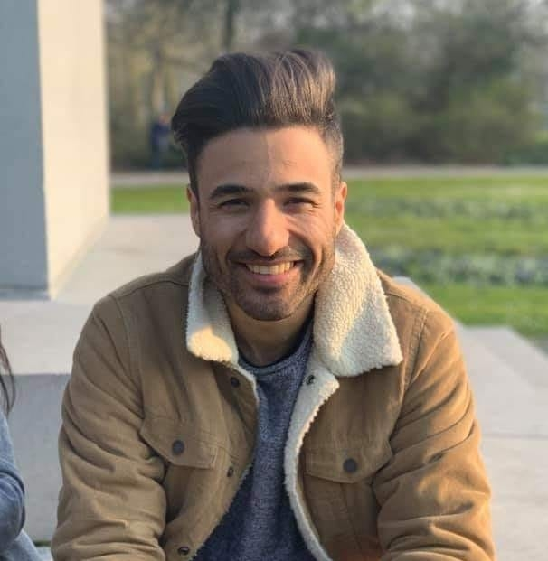

# SESSION 1
## Author: Kasra Tabrizi



Hi everyone!

I'm Kasra. I am passionate about Web Development. 

I am excited about the fabzero training course!

### Profile :man:

* Male
* 30 years old
* From Ghent

#### Hobbies :stars:

1. Literature
2. Electronics
3. Web Development

#### Code Example :laughing:

```javascript
var s = "If you are happy and you know it commit your changes ";
alert(s);
```

#### Social Media :thought_balloon:

[My Facebook](https://www.facebook.com/kasra.tabrizi)

#### Things I learned

I already worked extensively with github so the first session was nothing new for me.
The only thing new for me was working with jekyll to generate the static website.

[Go Back](README.md)

