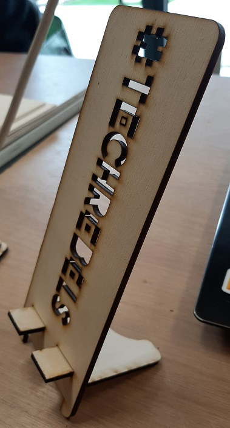

# SESSION 2 (11/03/2020)
## Author: Kasra Tabrizi

 - Introduction with the lasercutter
 - Download and install inkscape and learn the basics
 - project make a something that uses joints to connect pieces together

### Saturday 14/3/2020 - Lasercut session

### Project: phone stand

    

### Process of the smartphone stand

1. In the first version, the speed was set to 60 which didnt cut everything perfectly. I changed the speed to 50 and retried again(see the section on how to use the lasercutter for the reason). I couldnt slide the small piece into the larger piece because the slit was 3 mm. I took 3
mm because I assumed that it was the thickness of the multiplex wood. Normally you should always take a margin of 0.2mm. so I took 3.3 mm.

    

2. Second version also wasn't good due the thickness. The thickness of the multiplex wood was actually 3.5mm. so I took 3.7mm for the width of the slit. now everything works!

    

3. Some symbols on the smartphone stand

    

### Second project with shield

Create three different versions of the same shield but use red for cutting, black for engraving and blue for rastering
to see the difference. The engraving one didnt quite work. see mistake in picture (the top of the shield).

    

### Things I learned

#### 1. Inkscape

Try to position the drawings in a way that uses less wood on your board.

##### What I did first

    

##### What I did now

    

#### 2. How I worked with the lasercutter

- First turn on lasercutter. wait untill it is loaded
- Use the arrows on the lasercutter to position the laserhead
- Put the board in. apply duct tape so that the board is fixed when it is bended.
- Position the laserhead 1/3 of the width of the board.
- Calibrate lasercutter
- Turn on laptop - open your file in inkscape
- Press print and choose the right lasercutter
- A new window will open (Retina Engrave)
- Connect to the lasercutter, check the IP address
- Then press home
- Chose the right speed and power

As the lasercutter is used; after a while the laser wattage will decrease. So the values you use from the excell are all values based on when the lasercutter was used in the beginning. It possible that you have to change the speed. For example when it is 60, you change it to 50 for cutting.

If everything is set, then press play.

### Design files

[SVG file of the phone stand and shield](../inkscape)

[Go Back](../README.md)

