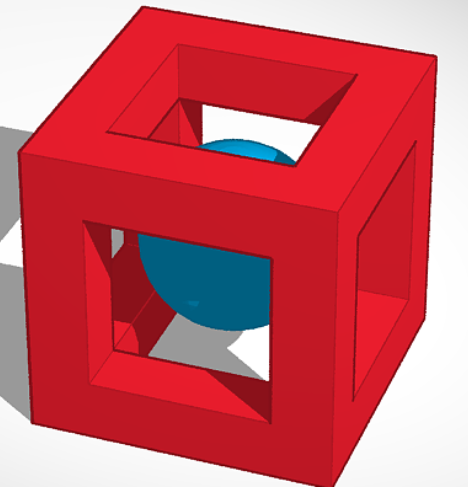
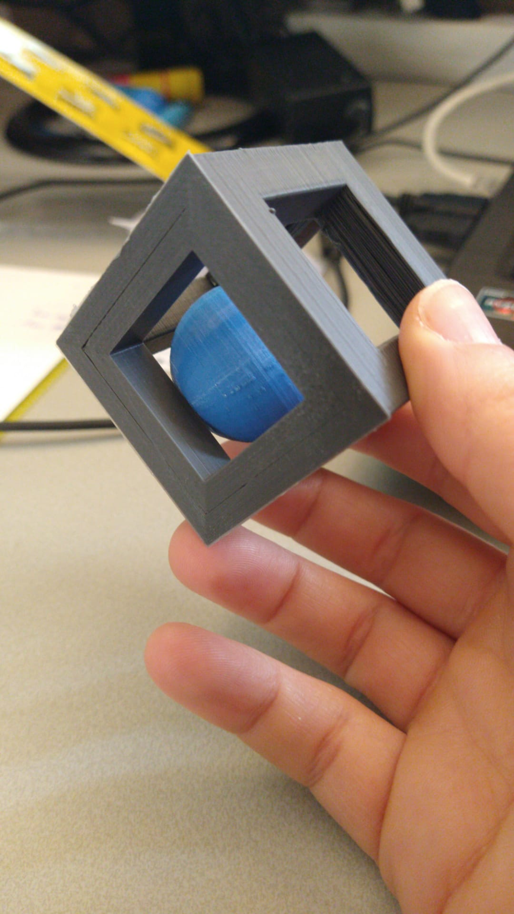

# SESSION 3 (18/03/2020)
## Author: Kasra Tabrizi

- Introduction to the 3D printer
- Explanantion about Tinkercad en Onshape
- Installing KiCad

### What can you print with a 3D printer

- Gadgets (small statues)
- Prototypes (gears, etc)
- Customised (pieces for oldtimers, prosthetics)

### problems you get with 3D printing

1. Have support
2. Print different parts and connect them together
3. Change the orientation of the model.

### YHT rules

- When you buy 3D print, test the YHT rules to see how it behaves. However there are models we can use to test our 3D printer out that already incorporate the YHT rules.
[10 best 3d models to test your 3d printer](https://all3dp.com/2/3d-printer-test-print-10-best-3d-models-to-torture-your-3d-printer/)

### Types of Printers

 - FDM with plastic filament
   - ABS (same material used for LEGO)
   - PLA (most commonly used and biological degradable)
     -you can use aceton on it to make the models more shiny and getting rid of the rough edges
 - SLA with uv light that hardens the liquid resin
 - SLS (powder) used for metal

 Note for FDM printers: the more you use the 3d printer to bigger the hole of the nozzle becomes. Once in a while you have to replace the nozzle with a new one.

### Assignment

- 3d print something in one piece that has mechanics in it or print something that can't made made with a lasercutter or CNC cutter

#### Project: Ball in a Square

For the assignment, I designed a ball in a square. The point of this design was to make the ball move freely while it remains trapped inside the square.
I used TinkedCad to make the model

    

#### Process

1. I created a square 50x50x50 mm. To make square hollow, I created three boxes with 70x30x30 mm. I positioned them in the middle of the square along the width, length and height. All three of the boxes are holes instead of solids and then I grouped everything together (See image below):

##### Step 1

    

##### Step 2

    

##### Step 3

    

##### Step 4

    

##### Step 5

Adding the ball inside the square.

#### Result:

The first print of this model failed because for some reason the space of some sides of the square were larger than the other. Because of this, the ball easily came out the square. 

    

For the next step, I made the ball bigger. The second, the print succeeded!

    

### Design files

<ul>
    <li><a href="3D projects/ball_in_a_square.stl" download>Ball_in_a_square_version1.svg</a></li>
    <li><a href="3D projects/ball_in_a_square_versie2.stl" download>Ball_in_a_square_final.svg</a></li>
</ul>

[Go Back](../README.md)