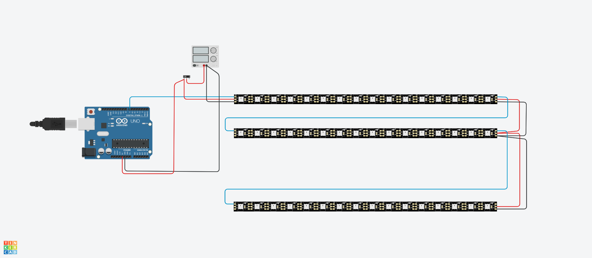

# SESSION 4 (25/03/2020)
## Author: Kasra Tabrizi

- Introduction to Electronics by Bruce
- Learning some simple schematics
- Combining Arduino with some Electronics component

### Basics

1. Resistor = Electrical property of a material that resist the amount of current running through it.
   Each material has a different resistor. Copper is used the most for cables, PCB routes because it is cheap.
2. Voltage = Difference in electrical potentional between two points. It can be positive and negative.
3. Current = transportation of electrical charge.
4. Power = the speed of which electrical energy moves.

### Formula

#### Ohms Law

U = I x R 
I = U / R

#### Power

P = (U x U) / R

#### Conclusion

If Voltage increases, the current increases
If the Resistance increases, the current decreases
If the Resistance increases, the voltage increases

### Tools

1. Power Supply
2. Multimeter for measuring AC/DC Voltage, Current, Resistance, etc
3. Osciloscope
4. Signal generator (Sine, square, triangle, sawtooth)

### Types of Resistors

1. Normal Static Resistor (has color bands for displaying the resistance value. Use the color codes for finding the value)
2. Potentiometer
3. LDR
4. NTC and PTC (temperature resistor)
5. Flexible Resistors

### Switches

1. Normal open / closed
2. Tactile switch
3. Multiple poles
4. SPDT (Single Pole Double Throw)

### Inductor L

A coil wrapped around a core with multiple turns of wire.
A coil always resists change. A coil stores current

### Capacitor C
A capacitor consists of two metals plates seperated by a subtrate. It will store charge.

### Relais

An electrical operated switch that works with a coil. When a voltage is applied across the coil, it will close the switch.

### Diode

A component that only lets current flow in one direction.

1. Zenerdiode (stabilisator)
2. Schotkeydiode (Lower forward voltage)
3. Photodiode (light sensitive)
4. LED (led emitting diode)

### Transistor

A component that can either be used as a switch or as an amplifier. (Current controlled)
It has three pins: base, collector and emitter

A Transistor has ...

1. Current gain HFE
2. Base Emitter Voltage
3. Collector Current

Other types of transistor:

1. MOSFET (Voltage controlled)

### Voltage Regulator

A component that converts voltage to another voltage.

### Circuits

1. Voltage Divider = uses two resistors in serie to divide the voltage.

### Assignment 

- Create a circuit and make some calculations

#### Project: LED Matrix Display

I decided to work further on my led matrix display I made last year.
I'm using 16x22 LEDS using the 2812B ledstrip 

[Amazon Link](https://www.amazon.com/BTF-LIGHTING-Flexible-Individually-Addressable-Non-Waterproof/dp/B01CDTEJBG/ref=redir_mobile_desktop?ie=UTF8&aaxitk=DwlGuxD-QS3avXZ12UxnJA&hsa_cr_id=3175378110301&ref_=sb_s_sparkle).

For this project and the calculations, I'll be using the Arduino. But later I would like to use a raspberry pi.

<p align="center">
    
</p>


##### Calculation

According to the datasheet of the WS2812B, it uses 5V as the power supply voltage.

One RGB Led will use 60mA at full brightness so the maximum power of on RGB led would be

```
60mA * 5V = 0.3W or 300mW
```

My matrix led display has a dimension of 16x22 leds so I have

```
16 x 22 = 352 LEDs
```

So my display would dissipate 105.6 W if all LEDs would light up at maximum

```
352 Leds x 0.3W = 105.6W
```

But since I would never light up all LEDS at maximum continuously I assume the power would be a bit less.

How much does the Arduino use at maximum? (eventhough this will probably never be the case)

```
5V x 200mA = 1W
```

So therefore I will use a 5V/30A power supply with a maximun of 150W of power. That way I'm sure the Arduino and ledstrips will get
enough power.


[Go Back](../README.md)