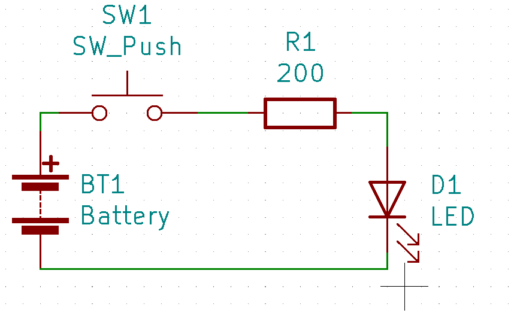
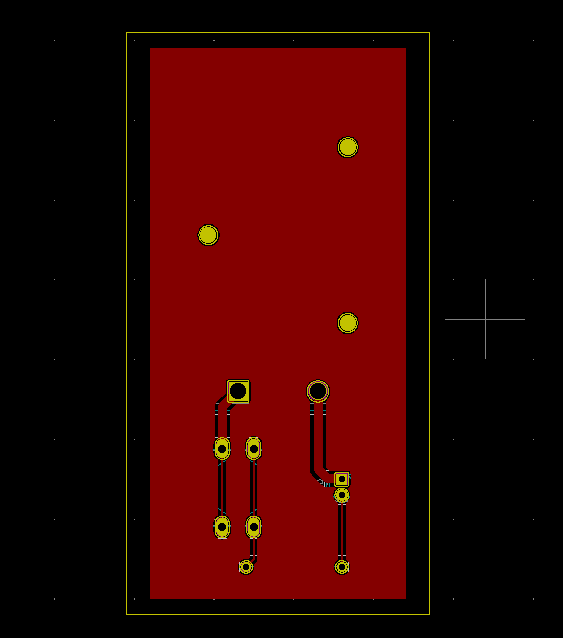
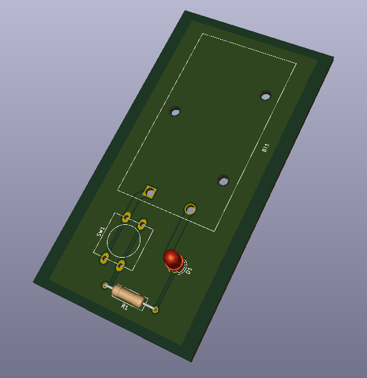

# SESSION 5 (01/04/2020)
## Author: Kasra Tabrizi

- Introduction to KiCad
- Learning to Draw schematics
- Learning to create PCB layouts for those schematics

### History

In the early days of electronics, components were just soldered together.

    

    

This made it very difficult to replace a component or to troubleshoot. Everything looks messy at the end.

That why they invented the PCB board where components would be mounted on a green board and connected via copper lanes.

    

### Prototype

Prototyping of a circuit could be done in several ways.

You can use PCB with predrilled holes

    

You can use a breadboard

    

### PCB Production methods

#### Milling

The disadvantage of milling is that you are limited to the smallest mill cutter. Mill cutters also worn out pretty fast.

    

#### Etching

Etching is the process where you etch away all the copper on the PCB that you dont need revealing only the copper lanes.

    

### Assignment

- Make a small schematic that consist of a battery holder, switch, LED and resistor.
- make the PCB layer of it

#### Process

##### Schematic

    

##### PCB Layout

    

##### 3D View

    

### Design files

<ul>
    <li><a href="kiCad/session5_exercise/session5_exercise.sch" download>session 5 exercise schematic</a></li>
    <li><a href="kiCad/session5_exercise/session5_exercise.kicad_pcb" download>session 5 exercise pcb</a></li>
</ul>

[Go Back](../README.md)