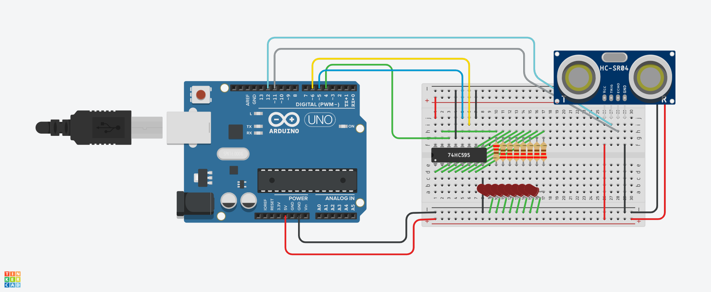
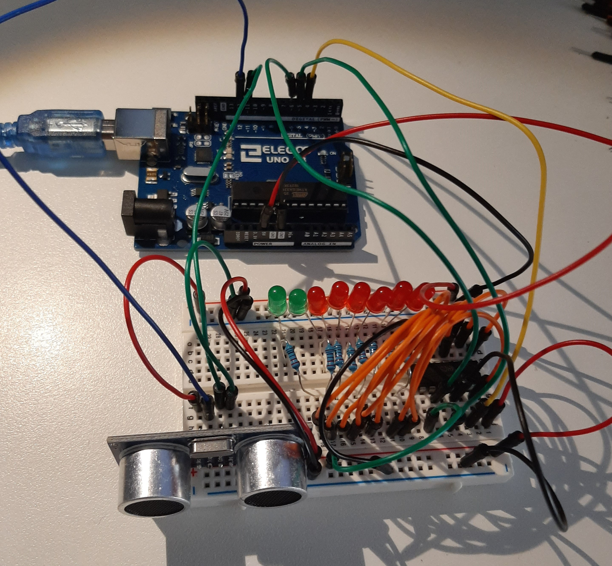

# SESSION 6
## Author: Kasra Tabrizi

- Introduction to Arduino
- Introduction to the Basic Kit
- Making some exercises

### What is an Arduino

Arduino is an open source computer platform, meant to make the use of a microcontroller easy.
Arduino is used by students, hobbyist, artist and everyone that is interested in the making of smart and creative objects.

<p align="center">
    
</p>


### Assignment

Create a circuit which uses more than one component of the Arduino Basic Kit.

#### Project: Ultrasone Distance LED Indicator

For this assignment I'm going to light up one of the 8 LED's according to the distance measured by the UltrSone Sensor.
I will use the following component:

1. Arduino Uno.
2. BreadBoard.
3. SN74HC595 8bit serial to parrallel shift register.
4. 8 x LED's.
5. 8 x 220 Ohm resistor.
6. Ultrasone Sensor.
7. Breadboard Wires.

#### Schematic

I first of all drew the circuit using TinkerCad.

<p align="center">
    
</p>

#### Circuit

<p align="center">
    
</p>

#### Code

```
int duurtijd;
int afstand;
int echo = 11;
int trigger = 12;

int latchPin = 5;  // Latch pin of 74HC595 is connected to Digital pin 5
int clockPin = 6; // Clock pin of 74HC595 is connected to Digital pin 6
int dataPin = 4;  // Data pin of 74HC595 is connected to Digital pin 4

int value = 0;

void setup() {
    //set pins to output so you can control the shift register
  pinMode(latchPin, OUTPUT);
  pinMode(clockPin, OUTPUT);
  pinMode(dataPin, OUTPUT);
  
  pinMode(echo, INPUT);
  pinMode(trigger, OUTPUT);
  Serial.begin(9600);
}

void loop() {
  //clear shift register
  digitalWrite(latchPin, LOW);

  shiftOut(dataPin, clockPin, MSBFIRST, distanceToByte(readDistance()));

  //put latchpin on HIGH
  digitalWrite(latchPin, HIGH);
  delay(100);
}

int readDistance(){
  digitalWrite(trigger, HIGH);
  delayMicroseconds(10);
  digitalWrite(trigger, LOW);
  duurtijd = pulseIn(echo, HIGH);
  afstand = duurtijd / 29;
  afstand = afstand / 2;
  Serial.print(afstand);
  Serial.println("cm");
  return afstand;
}

int distanceToByte(int afstand){

  if(afstand <= 1){
    return 1;
  }
  else if(afstand <= 4){
    return 2;
  }
  else if(afstand <= 8){
    return 4;
  }
  else if(afstand <= 10){
    return 8;
  }
   else if(afstand <= 13){
    return 16;
  }
   else if(afstand <= 16){
    return 32;
  }
   else if(afstand <= 20){
    return 64;
  }
   else if(afstand >= 25){
    return 128;
  }
}
```


[Go Back](../README.md)